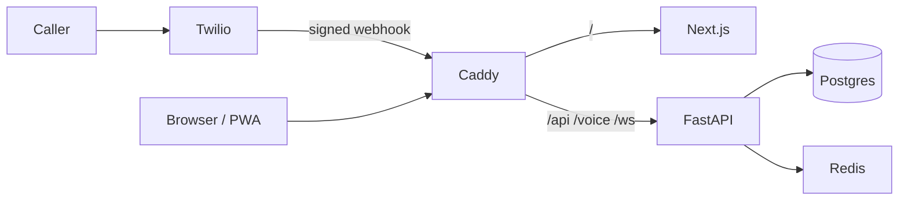

# HavenID

A private, self-hosted personal identity and phone hub. One owner. Your VPS. Apple-ID-style login plus contacts, call history, and an automatic spam-call bot.

Data stays on the machine you control except the minimum Twilio signaling needed to complete a call.

## Vision

HavenID is the account you own: email, passkeys, trusted devices, and a
**screening number** you publish. Unknown callers hit a challenge. Known
contacts forward to your iPhone. Your real cell number stays private.

This is not a CallKit intercept of the existing iPhone line. Apple does
not allow that kind of third-party IVR. See `docs/PRODUCT.md`.

**Parked** for a public webhook / production host. Local Twilio works.
Resume: `docs/PARKED.md`.

MIT. Issues on this repo only.

## Features

- Email login, argon2id passwords, mandatory TOTP, recovery codes, WebAuthn passkeys
- Trusted devices, rotating session cookies, export, account delete
- Dashboard: overview, contacts, call log, allow/deny lists, security audit
- vCard import/export and a documented REST API
- Twilio inbound pipeline: lists, challenge, optional Grok classify, reject / voicemail / forward
- Works with **no** xAI key (rules + press-1)
- Docker Compose + Caddy HTTPS + backup scripts

## Architecture



More: `docs/ARCHITECTURE.md`

## Prerequisites

- Ubuntu 22.04 / 24.04 VPS, 2 vCPU / 4 GB RAM recommended
- A domain name pointed at the VPS
- Docker Engine + Compose plugin
- Twilio account (trial is enough to test challenge/reject)
- Optional: xAI API key, SMTP

Do **not** drop this stack onto a busy trading/ops box unless you accept the RAM and PII mix.

## Local development

```powershell
cd $env:USERPROFILE\HavenID
copy .env.example .env
# set BOOTSTRAP_EMAIL, BOOTSTRAP_PASSWORD, HAVEN_SECRET_KEY, HAVEN_DATA_KEY

cd apps\api
py -3 -m pip install -e ".[dev]"
$env:DATABASE_URL = "sqlite+aiosqlite:///./havenid.db"
$env:REDIS_URL = ""

# Agent-safe (detaches, waits for health, then exits):
powershell -ExecutionPolicy Bypass -File $env:USERPROFILE\HavenID\scripts\start-api.ps1
powershell -ExecutionPolicy Bypass -File $env:USERPROFILE\HavenID\scripts\start-web.ps1

# Human terminals only (these never return, so do not run them from Grok):
#   cd apps\api; py -3 -m uvicorn app.main:app --reload --port 8000
#   cd apps\web; npm run dev
```

Open http://localhost:3000/login

Tests:

```powershell
cd $env:USERPROFILE\HavenID\apps\api
py -3 -m pytest
```

## VPS deploy

1. Copy this tree to the server.
2. `cp .env.example .env` and fill secrets, `HAVEN_DOMAIN`, `HAVEN_PUBLIC_URL=https://YOUR_DOMAIN`.
3. Set `COOKIE_SECURE=true` and `HAVEN_ENV=prod`.
4. `chmod +x scripts/*.sh && ./scripts/install-ubuntu.sh`
5. Caddy issues certificates for `HAVEN_DOMAIN`.
6. Sign in with the bootstrap email. Enroll TOTP. Save recovery codes.

Backup: `./scripts/backup.sh`  
Restore: `./scripts/restore.sh backups/havenid-....tgz`

## Twilio

See `docs/TWILIO.md`.

Important: Twilio **trial** blocks `<Dial><Number>` and `<Record>`. Forwarding and voicemail need an upgraded account. Set `TWILIO_TRIAL=false` after upgrade.

Typical US cost (confirm live): about $1.15/month for a number plus under a cent per inbound minute. Budget one number + 200 minutes + occasional forward.

## Connect a real phone

1. Buy a Twilio Voice number.
2. Point Voice URL at `https://YOUR_DOMAIN/voice/inbound`.
3. Add your cell as a forward target (upgraded account).
4. Call the Twilio number. Unknown callers should hear "Press 1".
5. Mark spam from the Calls table to feed the denylist.

## API

`https://YOUR_DOMAIN/api/docs` and `docs/API.md`.

## Security and compliance

`docs/SECURITY.md` and `docs/COMPLIANCE.md`.

You are responsible for local recording consent, TCPA, and Twilio acceptable use. Recording stays off until you flip the dashboard toggle and the legal checkbox.

## License

MIT. See `LICENSE`.

## Roadmap

SMS, SIP, native apps, family sharing, STIR/SHAKEN, CardDAV. See `docs/ROADMAP.md`.
