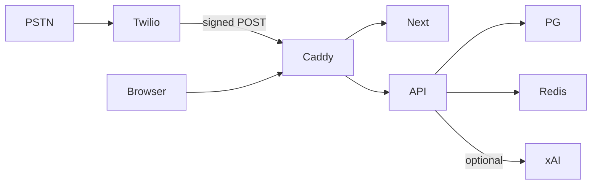

# HavenID architecture

Same-origin Caddy edge:

- `/` Next.js dashboard (PWA)
- `/api/*` FastAPI
- `/voice/*` Twilio webhooks
- `/ws/live` live heartbeat

Postgres holds account, contacts, calls, lists, audit. Redis (or in-process memory) holds pending logins, rate limits, and in-flight call state.

The inbound call pipeline is a pure function in `apps/api/app/pipeline/engine.py`. Twilio (or the simulator) supplies From/To/Digits. The engine returns an action. `twiml.py` renders XML.

